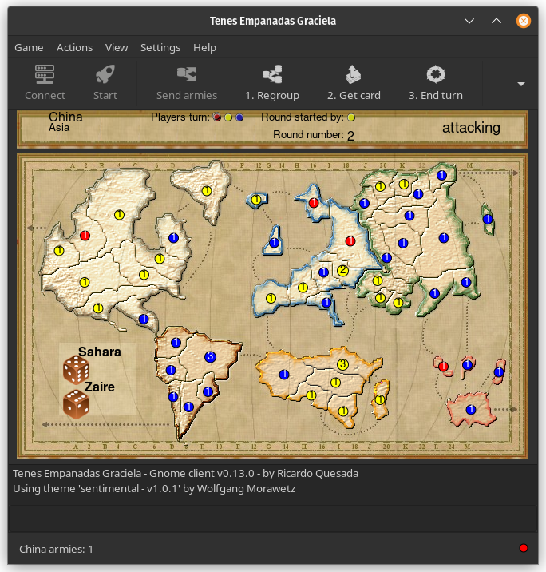

# TEG

Tenes Emapandas Graciela is a clone of 'Plan Táctico y Estratégico
de la Guerra', which is a pseudo-clone of Risk, a multiplayer turn-based
strategy game. Some rules are different.

# Brief history of TEG

__riq__

Sebastián Cativa Tolosa, once told me to do this game.
I think that was in 1996, in a chat we were having in the University.
Well, we started to think the game. But I don't know why, the project died after 3 or 4 months.
In 1998, the project was reactivated, but after 2 weeks it died again :(.
Finally, in February 2000, I started the game again, and it seems that it is not dead :-).

!!! quote "wfx"
		... 2024 and it is still alive ;-)

# Screenshots
{width="320"}
{width="320"}