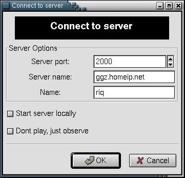
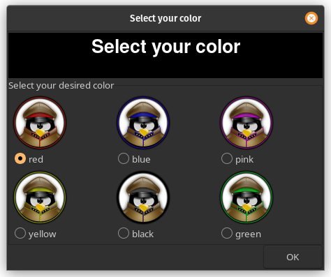
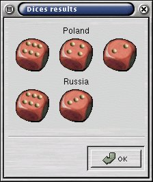
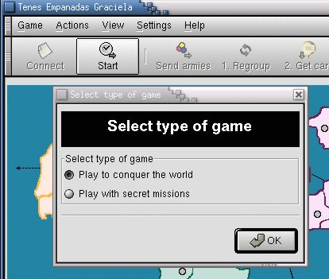
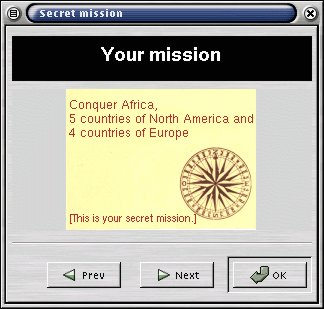
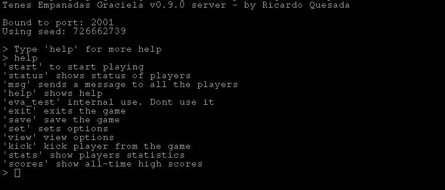

# Tenes Empanadas Graciela Manual

## Introduction

Tenes Empandas Graciela (TEG), is a clone of an Argentinian game called 'Plan Táctico y Estrátegico de la Guerra',
a modified clone of the turn based strategy game 'Risk'. It is a multi-player game that can be played across the Internet.

The target of the game is to conquer all the countries of the world, which are displayed in a map,
or to accomplish your secret mission (if you prefer to play with secret missions). In order to achieve this goal,
the player is supposed to create a certain strategy (i.e. try to conquer one continent in the first place,
protecting its borders once this first step have been achieved. Only then, try to conquer another continent).

## Playing the game
Connecting to the server

To connect to the server, you must know the address and port of the server.
The well-known port of the server is 2000.
You must tell the client this through the connect dialog.

After filling the 'Connect Dialog', you'll have a new dialog, which will ask your favorite color.

If you select a color that it isn't available, the server will select a color for you

## Starting the game

In order to start the game, there should be at least 2 and a maximum of 6 players connected to the server.
Once connected, any of the said players can start the game by clicking on the start button of his client.
No more players are allowed when the game has already started

After clicking on the start button, the 'Type of Game' dialog will appear.

The server, will then distribute all the countries at random among the players, providing each country with an army.

!!! note

    One can also connect to the server as an observer.
    This enables to follow the game, but not to play.
    It is noteworthy to keep in mind that there is a maximum number of 9 connections permitted in this mode.

## Placing the armies for 1st time

To place the the armies for 1st time, you must wait your turn. Once you are given the turn, you must place 5 armies in your countries.
After that, send them to the server clicking on send armies button.
Then, you must wait again for your turn, and place another 3 armies in your countries.
You can place all the armies in one country if you want (there is no limit on the number of armies per country).
Once all the players have placed the 8 armies, you will be able to attack.

## Attacking an enemy

To attack an enemy, you must wait for your turn.
When you receive the turn you can attack as many times as you want.
To attack, you must select 2 countries: the source country (your country), and the destination country (your opponent country).
The source country must have at least 2 armies, but there is no restriction on the quantity of the destination country.
The source and destination countries must be frontier.
Frontiers countries are the ones that have common borders or a line that connects them.

When you attack, you throw 'n' dices, where 'n' is the number of armies that you have in your country minus one,
but no more than 3. Your enemy will throw 'm' dices, where 'm' is the number of armies that he has in his country,
but no more than 3. After that, the results of the dices are sorted in a descedig order.

The results are compared, the greatest result, with the greatest result, and so on.
If the there is a draw, or if the destination's result is greater, then the source country must take one of his armies off,
otherwise the destination country must take one of his armies off.

You will conquer the country if your opponent runs out of armies.
In that case you can move as much as 3 armies to the conquered country (from the source country)

__Armies example:__
   - If you have 3 armies, and your opponent has 3 armies, you will throw 2 dices, and your opponent 3.
   - If you have 5 armies, and your opponent has 2 armies, you will throw 3 dices, and your opponent 2.
   - If you have 1 army, you cant attack

__Dices example:__
   - If you get a: 6, 4, 2, and your opponent gets 6, 3, the result is: 6 vs. 6, 
     and your opponent wins (you take away one of your armies), 
     and the other is:4 vs. 3 , and you win (your opponent takes away one of his armies).
   - If you get a: 4, 2, 2, and your opponent gets 3, 2, 1, the result is: 4 vs. 3,
     and you wins (your opponent has to take away one of his armies). The 2nd result is:2 vs. 2,
     and your opponent wins (so you have to take away one of your armies), and the last result is 2 vs. 1 and here you win, 
     and your opponent has to take away one of his armies.

<!--
Do we still have this dialog?

-->

!!! tip
    Don't attack a country that has more armies than yours.

## After the attack

After your attack you can Regroup your armies.
You can move as much as 3 armies from one country to another one (they must be frontier countries),
and the army that is moved once, won't be able to be moved again in that turn.
After you finish your Regroup armies, and before you End your turn you can Get country card.
If you want to Get country card you must have conquered at least one country in your turn, and if that is OK, 
you will be given a country card chosen randomly. If the country that represents the card is yours,
that country will be added 2 armies automatically. Otherwise you will be allowed to place 2 armies later if you conquer it.
There are 4 types of cards: galleon, cannon, balloon or a joker.
When you have 3 different cards or 3 cards of the same type you can exchange them for armies.

| Number of exchange | Quantity of armies received |
| ------------------ | --------------------------- |
| 1                  | 4                           |
| 2                  | 7                           |
| 3                  | 10 (and now add 5)          |
| 4                  | 15                          |
| 5                  | 20                          |
| ...                | ...                         |

After the 3rd exchange, you will have to conquer 2 countries (instead of one) to 'get a country card'

Finally, you must press End turn to finish your turn, and give it to the next player

## A new turn

When all the players finished their turns, a new turn will start. This time,
the first player to start will be the 2nd player of the last turn.
This player will have to place a certain amount of armies in his countries. 
If a player has conquered an entire continent, he will have to place:

| Continent	     | Quantity of armies |
| -------------- | ------------------ |
| South America	 | 3                  |
| North America	 | 5                  |
| Africa	       | 3                  |
| Europe	       | 5                  |
| Asia	         | 7                  |
| Oceania	       | 2                  | 

???+ note
  Those armies must be placed in the conquered continent

After all the players have finished placing their armies, you will be able to attack again.

## Playing with secret missions

You can choose between playing with secret mission, or to conquer the world.

???+ note
  If you know that only 2 players are going to play, its better to use the 'conquer the world' option

If you play with secret mission, you can win achieving your secret mission, or achieving the common 'secret' mission,
which is to conquer 30 countries of the world. If you play with conquer the world you win only conquering the entire world.

The winner is the player who achieves his mission first.
You can also, change the type of game from the server's console.
Just type set conquer_world=0 or set conquer_world=1 to switch between secret missions or conquer the world.

### Viewing your mission

To view your secret mission, just click on view->mission in the client

## The Server

### Strating the server

You can start the server, executing the command tegserver or from the connect dialog of the client,
clicking in the Start server locally

### Server commands

The server has very useful commands to configure it. Just type help and you will see all the available commands.

## History

### Brief history of TEG

__riq__

Sebastián Cativa Tolosa, once told me to do this game.
I think that was in 1996, in a chat we were having in the University.
Well, we started to think the game. But I don't know why, the project died after 3 or 4 months.
In 1998, the project was reactivated, but after 2 weeks it died again :(.
Finally, in February 2000, I started the game again, and it seems that it is not dead :-).

__wfx__, now we have 2024 and it is still alive :fontawesome-regular-face-laugh-wink:

